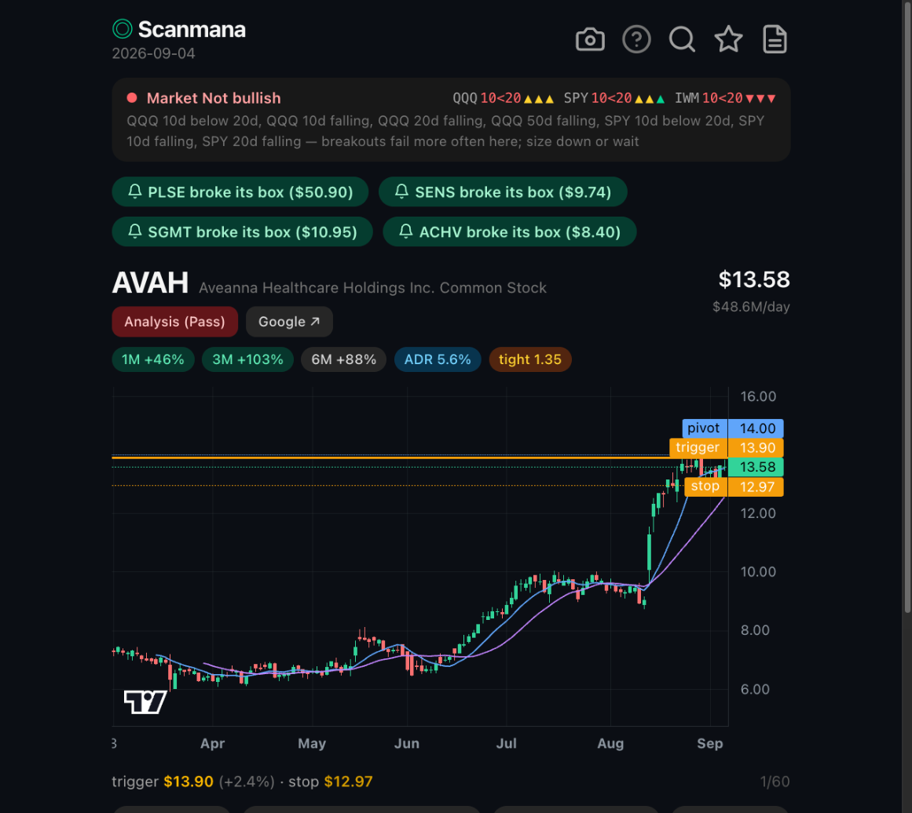
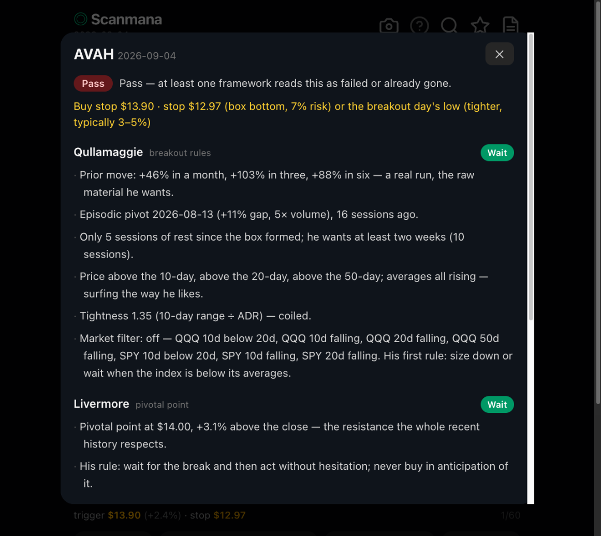
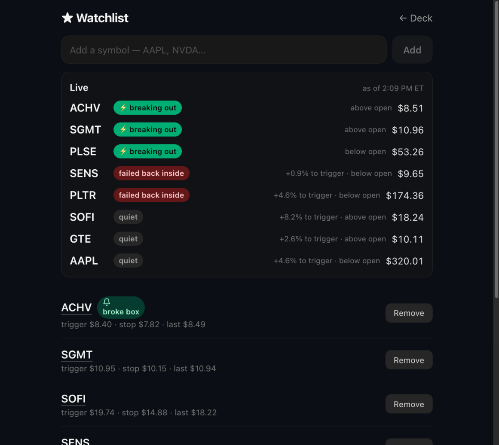
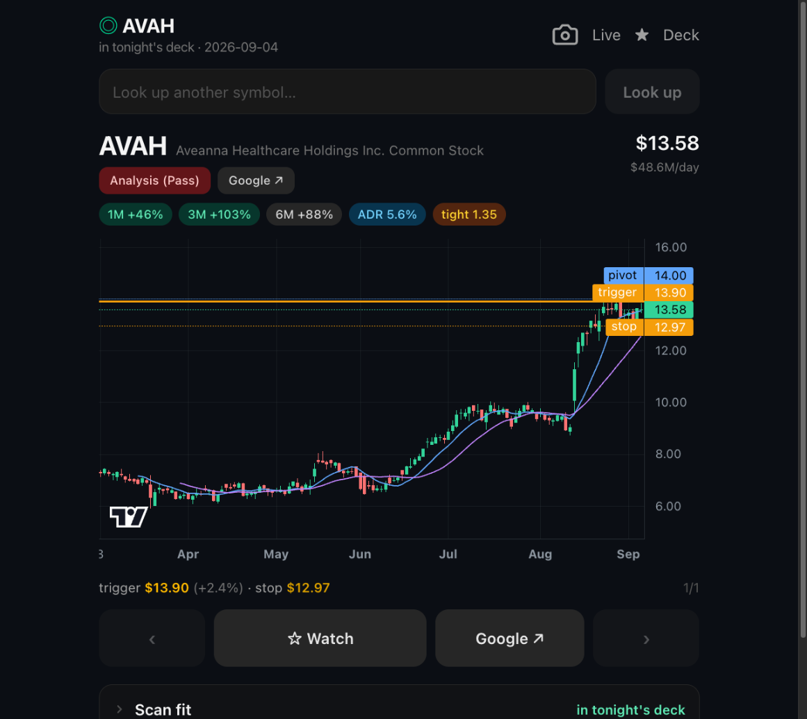
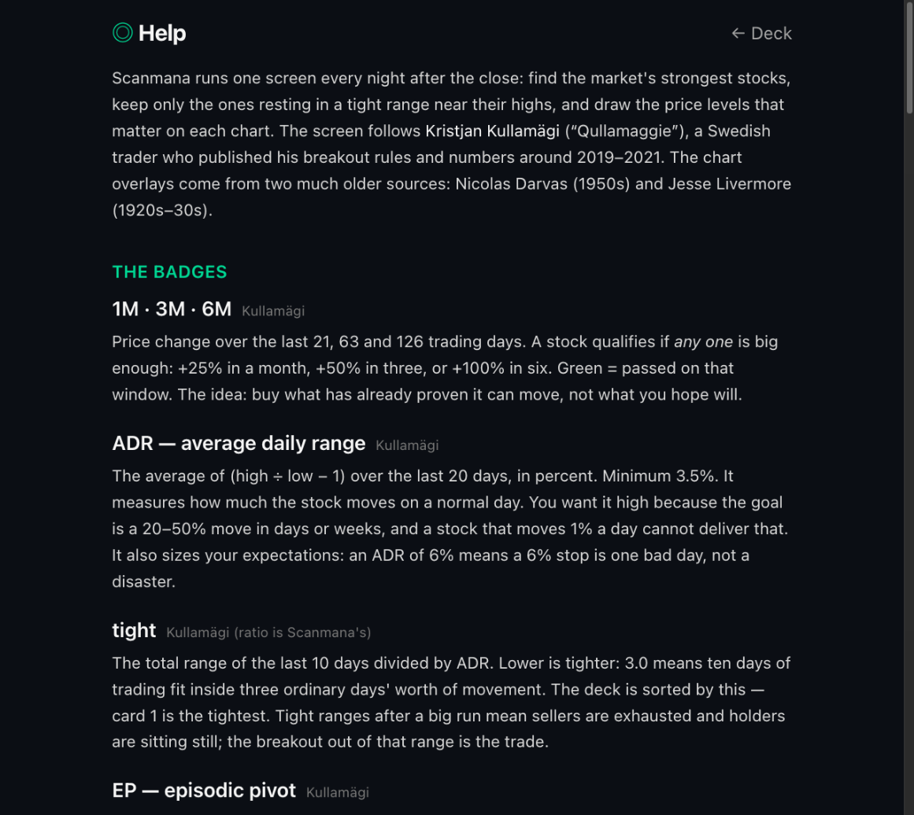

# Scanmana

> Current project state, infra gotchas, and open questions live in [HANDOFF.md](HANDOFF.md) — read that first.

Personal EOD momentum scanner as a mobile-first PWA. Engine: Qullamaggie-style
breakout screens (momentum leaders in tight consolidations) with Darvas boxes
and Livermore pivotal points drawn on each chart as entry-trigger / stop-zone
overlays.

## Screenshots

| Deck | Analysis | Live watchlist |
|---|---|---|
|  |  |  |

| Symbol lookup | Help |
|---|---|
|  |  |

## How it works

- A nightly Vercel cron (`/api/cron/scan`, weeknights ~midnight ET) pulls the whole
  US market's daily bars in **one** grouped-daily API call (Massive, formerly
  Polygon.io — free Basic tier), upserts them into Neon Postgres, runs the
  screens, stores the ranked result, and sends one web-push notification.
- The PWA is a thin viewer: a deck of annotated candidate charts, paged from a
  fixed bottom bar of line icons (prev · watch · deck list · Google · next)
  (wraps around: past the last card comes the first, and vice versa)
  (lightweight-charts), a watchlist with "broke its box" alerts, and a `/help`
  page that carries the **↻ Run scan for previous day** button
  (`POST /api/scan/run` — no secret, never forces, so it can only run the scan
  the cron would).
- **One top nav on every page** (`components/TopNav.tsx`): the ◎ Scanmana logo
  always goes home, a page line sits under it, and the same four icons sit on
  the right — Help, symbol lookup, ★ Watchlist, deck list — with the current
  page's icon lit. The symbol page adds its Live toggle beside them.
- **Market strip** above the deck: Kullamägi's index filter on QQQ/SPY —
  10-day > 20-day, price above the 20 and 50, all three rising → **Bullish**,
  otherwise **Not bullish** naming the failing condition. IWM shown for
  breadth. `/help#market` charts all three ETFs with their 10/20/50 SMAs.
- `/help` explains every badge and chart line (ADR, tightness, EP, Darvas
  trigger/stop, Livermore pivot, the SMAs), who each idea comes from and how
  to trade it — numbers read live from `lib/config.ts`.
- **Analysis (Wait / Pass)** button under each symbol — the label is the
  overall verdict, stamped on the candidate at scan time — opens a rule-based read of the card
  through Kullamägi's breakout rules, Livermore's pivotal point, the Darvas
  box and Minervini's VCP (progressively shallower contractions, volume
  dry-up, pivot) — Wait / Pass per framework with the reasons (no "Take": EOD data can
  only say what to watch at tomorrow's open, never to buy now), plus a trade plan
  (trigger · stop · risk) when one exists. Computed at scan time
  (`lib/analysis.ts`), stored in the `analyses` table, served by
  `GET /api/analysis`. `npm run analyze` recomputes for the latest scan.
- **List** icon (header, next to ★): every setup in tonight's deck on one screen
  with its Wait / Pass chip, price, box and ★ markers, and a tally at the
  top — no need to page through each card. Tap a row to jump the deck to it.
- **Google ↗** (a chip beside the Analysis button and a button beside ☆ Watch) opens a `<symbol> stock` Google search in a new tab (Google's COOP header
  forbids single-tab reuse; the iOS PWA shows it in one in-app sheet anyway). On
  desktop, pressing space opens the search for the current card.
- Watchlist symbols come from ☆ on cards or the **Add** field on `/watchlist`
  (hand-added names get their trigger/stop computed from stored bars).
- **Live watchlist** (top of `/watchlist`): every starred name classified from
  live quotes — ⚡ breaking out, failed back inside, below stop, approaching
  (within 2% of trigger), quiet — with distance to trigger and above/below
  open. Polls every 60s while the page is open; quotes are cached in a shared
  Neon `quotes` table, so every device and function instance shares one
  fetch per symbol per minute (30 min off-hours).
- **Live deck** (home page, `GET /api/scan/live`): the same read for every
  card in tonight's deck — a chip beside the badges, the live price with the
  stored close under it, and the trigger distance from the live price. The
  `/deck` page (list icon in the header, **Deck** in the bottom bar) lists
  the whole deck with a **Live** toggle that groups it breaking / failed /
  stopped / approaching / quiet with a tally; tap a row to open that card. Finnhub's free tier is
  60 calls/min, so each poll refetches at most a budget of stale symbols,
  oldest first (`CONFIG.LIVE`: deck 30, watchlist 25), and serves the rest
  from the cache with their age; a 60-name deck is fully fresh every two
  polls. One bad symbol drops only itself and a 429 halts the refresh
  instead of failing it.
- **Camera** icon in the top nav (home and symbol pages): captures the whole
  page — header, card, chart, and the Scan fit + Minervini VCP checklists —
  as one tall PNG (html-to-image; falls back to a chart-only capture) and
  opens the native share sheet — on iOS that includes Print and Save Image;
  desktop downloads the file. The standalone PWA has no browser chrome, so
  this is the print path.
- **Look up any symbol** (search icon in the header → `/s`): type AAPL or NVDA and get the
  same card the deck shows plus a **Scan fit** checklist — each hard rule of
  the nightly screen (`explainScreen` in `lib/screen.ts`, the same list
  `screenTicker` enforces) with the number behind it, so you see exactly why a
  name is or isn't a Scanmana setup, plus an informational Minervini-VCP
  block (contraction sequence, final tightness, volume dry-up — an analysis
  lens, not a screen filter). Deck cards carry the same two panels below the
  buttons, collapsed to one-line summaries (every deck name passes the screen). A **Live** toggle reruns the whole read intraday:
  Finnhub free quotes (symbol + QQQ/SPY/IWM, 30-minute in-memory cache) become
  a provisional today-bar — volume assumed at the 20-day average — and the
  market filter recomputes from the live indexes; failures fall back to EOD
  with a note. The Analysis modal for a symbol outside the scan
  is computed on the spot from stored bars and labelled "computed now, not
  stored". Read-only; never touches the nightly results.
- Sign-in via Clerk (Vercel Marketplace): **Google** or an **email code**, no
  password. `proxy.ts` runs `clerkMiddleware`, sends signed-out pages to
  `/sign-in` and answers signed-out API calls with 401. Only allowlisted
  emails can sign up (Clerk dashboard → Restrictions), so the app stays
  single-user. Cron, manifest, service worker and icons stay public. Clerk
  runs as a development instance because production keys need a custom
  domain — see HANDOFF gotcha 4.
- Versioning: taskmana-mobile scheme — 0–9 per segment, `npm run bump`
  advances `package.json` + the `/help` footer line together, release commit
  titles carry `(x.y.z)`. The footer line is how you check what a device runs.
- Mobile-first, but desktop windows (≥1024px) use the full width: the chart
  fills the window, text pages get a wider readable column.
- All thresholds are hardcoded in `lib/config.ts` — tuning is a code edit.

## Screens (lib/config.ts)

Hard filters: price > $10 on every close of the last 21 sessions · 20d avg
dollar volume > $20M · US common stock/ADR · momentum (1M ≥ +25% OR 3M ≥ +50%
OR 6M ≥ +100%) · ADR% between 3.5 and 15 · 1M return ≤ +300% · close above
rising 10/20 SMA · within 15% of 6-month high. The ADR ceiling, return cap
and 21-session price floor are the parabolic guard: a sub-dollar shell that
spiked to $18 passes every floor on today's numbers alone. Ranked with boxed
setups first (there is a level to trade), then by consolidation tightness
(10-day range ÷ ADR). EP badge = 10%+ gap on 3× volume in the last 5
sessions.

## Setup

Run `./scripts/setup.sh` — a guided wizard that walks you through the Massive
API key, verifies it, runs the backfill, triggers the first scan, and prints
the iPhone install steps. Manual equivalent:

1. Secrets live only in Vercel env vars (`vercel env add <NAME> production`) — see `.env.example` for the list. Local commands pull them per-process with `vercel env run`; nothing goes in `.env.local`.
2. **Sign-in (Clerk).** `vercel integration add clerk` provisions
   `CLERK_SECRET_KEY` and `NEXT_PUBLIC_CLERK_PUBLISHABLE_KEY` on the Vercel
   project; add `NEXT_PUBLIC_CLERK_SIGN_IN_URL=/sign-in` and
   `NEXT_PUBLIC_CLERK_SIGN_IN_FALLBACK_REDIRECT_URL=/` yourself. Then in the
   Clerk dashboard (open it from the Vercel integration page):
   - Sign-in methods: **Google** and **email verification code** are on by
     default; leave password off as a sign-in method.
   - Restrictions → Allowlist: add your email and enable allowlist-only sign-ups
     (also doable with the Backend API: `POST /v1/allowlist_identifiers`, then
     `PATCH /v1/instance/restrictions {"allowlist":true}`). Google sign-in is
     checked against the same allowlist.
   - Sessions: set the lifetime you want (30 days here).
   - Domains: the app's URL must be listed for the instance.
3. `npm run migrate` — creates tables (idempotent).
4. `npm run backfill` — one year of daily bars, ~55 min on the free tier
   (5 calls/min). Resume-safe; re-run if interrupted. Then `npm run
   seed:indices` for the market strip's ETF history (3 calls).
5. Tap **↻ Run scan for previous day** on the app's Help page (or `npm run scan:now`, which calls `/api/cron/scan?force=1` with
   `CRON_SECRET` injected from Vercel).
6. On iPhone: open the deployed URL in Safari → Share → Add to Home Screen →
   open Scanmana from the icon → sign in once inside it (its cookie jar is
   separate from Safari's) → tap "Enable nightly scan alerts".

## Commands

All of these inject secrets per-process from Vercel (`vercel env run -e production`).

- `npm run dev` / `npm run build`
- `npm test` — engine unit tests (indicators, Darvas box, screens, market filter)
- `npm run migrate` / `npm run backfill [calendarDays]` / `npm run seed:indices` (QQQ/SPY/IWM history, once) / `npm run analyze` (recompute analyses for the latest scan)
- `npm run scan:now` — needs a readable `CRON_SECRET` (see HANDOFF gotcha 6); otherwise use the in-app button
- Deploy: git-connected since 2026-09-01 — `git push origin main` builds and promotes production automatically (`vercel --prod --yes` still works for an out-of-band deploy)

## Layout

- `lib/` — pure engine (`indicators`, `screen`, `darvas`, `livermore`,
  `market`, `analysis`), `scan.ts` orchestrator, `scan-notify.ts` (scan + push, shared by
  cron and button), `massive.ts` API client (retries, pre-EOD fallback),
  `db.ts`, `push.ts`
- `app/` — deck (`/`), `/deck` list, `/watchlist`, `/s/[ticker]` symbol page (same card for
  any symbol; watchlist rows link here), `/help`, `/sign-in`, API routes
  (`cron/scan`, `scan/run`, `scan/live`, `analysis`, `watchlist`,
  `watchlist/live`, `push/subscribe`)
- `proxy.ts` — Clerk gate; `lib/auth.ts` — public-path list; `app/sign-in/` — Clerk sign-in page
- `scripts/` — `setup.sh` wizard, `migrate`, `backfill`, `seed-indices`,
  `analyze`, `scan-now.sh`, `gen-icons.py`
- `tests/` — vitest suite with synthetic fixtures

Out of scope (v1, deliberate): intraday entries or verdicts (the live reads
are display-only — the scan and its Wait/Pass never change during the day),
parabolic shorts, settings UI, journaling, multi-user.

## License

MIT — see [LICENSE](LICENSE). Scanmana is an independent hobby project, not
affiliated with or endorsed by any of the traders or publishers whose published
methods it implements.
